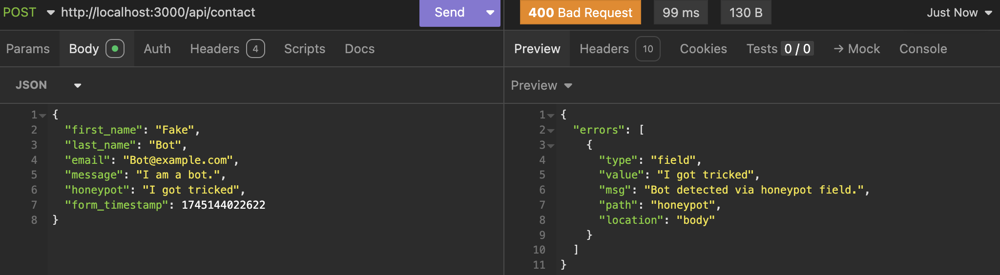
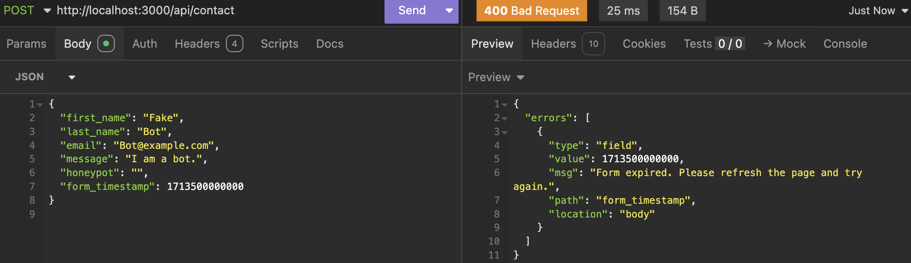
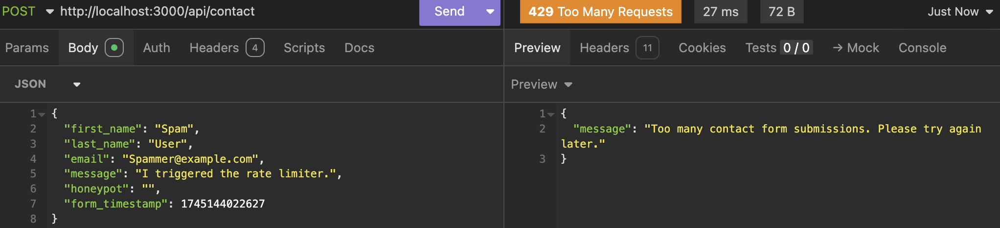

# Secure Contact Form Prototype

A multilayered, security-focused contact form implementation that protects against spam bots and common web vulnerabilities while providing a smooth user experience.

## Table of Contents
1. [Project Overview](#project-overview)
2. [Key Security Features](#key-security-features)
3. [Technologies Used](#technologies-used)
4. [Installation & Setup](#installation--setup)
5. [Usage](#usage)
6. [Customization](#customization)
7. [Documentation References](#documentation-references)

## Project Overview

This project is a prototype implementation of a secure contact form with multiple layers of protection. It demonstrates practical security measures that can be implemented to protect web forms from spam bots and malicious actors. This repository contains both the frontend interface and backend processing logic.

For a detailed discussion of the security concepts, industry trends, ethical considerations, and the development process, please refer to the accompanying blog post: **"Build a Secure Contact Form Without Plugins: A Comprehensive Yet Easy Guide"**.

## Key Security Features

The project implements several key security features:

1. **Honeypot Fields**
   - Hidden field in the form that remains invisible to humans but is often filled by bots
   - Any submission with data in the honeypot field is automatically rejected

2. **Time-Based Validation**
   - Timestamps record when forms are loaded
   - Submissions made too quickly (< 3 seconds) are flagged as likely bot activity
   - Submissions made too late (> 1 hour) are rejected to prevent replay attacks

3. **Input Validation & Sanitization**
   - Client-side validation provides immediate user feedback
   - Server-side validation ensures security enforcement
   - Field-specific validation rules with appropriate error messages
   - Input length restrictions to prevent overflow attacks

4. **Rate Limiting**
   - Limits submissions to 3 per minute per IP address
   - Prevents form flooding and brute force attacks
   - Returns proper JSON error responses when limit is exceeded

5. **User-Friendly Error Handling**
   - Specific error messages mapped to form fields for legitimate users
   - Generic error messages for suspected bot activity

## Technologies Used

### Frontend
- **HTML5**: Semantic markup with appropriate ARIA attributes
- **CSS3**: Responsive design with visual feedback states
- **JavaScript (ES6+)**: Form validation and asynchronous submission handling

### Backend
- **Node.js** (v18.x or later recommended): JavaScript runtime environment
- **Express.js** (v5.1.0): Web application framework
- **Express Validator** (v7.2.1): Server-side validation middleware
- **Express Rate Limit** (v7.5.0): Protection against flooding attacks
- **dotenv** (v16.5.0): Environment variable management
- **axios** (v1.8.4): HTTP client for API requests

## Installation & Setup

### Prerequisites
- Node.js (v18.x or later recommended)
- npm (v9.x or later recommended)

### Steps to Install

1. **Clone the repository**
   ```bash
   git clone https://github.com/Donjella/secure-contact-form.git
   cd secure-contact-form
   ```

2. **Install dependencies**
   ```bash
   npm install
   ```

3. **Create environment file (optional)**
   The project is configured to use environment variables through dotenv.
   Create a `.env` file in the root directory:
   ```bash
   touch .env
   ```
   And add the following content:
   ```
   PORT=3000
   ```
   Note: This step is optional as the server will default to port 3000 if no environment variable is specified.

4. **Start the development server**
   ```bash
   npm run dev
   ```
   Or for production:
   ```bash
   npm start
   ```

5. **Access the application**
   Open your browser and navigate to `http://localhost:3000`

Note that this project uses Node's built-in `--watch` flag for development instead of nodemon.

## Usage

### How the Contact Form Works

After installation, the contact form performs the following:

1. When a user fills out the form and submits it, client-side JavaScript performs validation, providing immediate feedback for any errors.
2. If client-side validation passes, the form data is sent via AJAX to the server endpoint.
3. Server-side middleware checks for rate limits, validates input, and performs bot detection.
4. If all security checks pass, the submission is logged to the console (in a production environment, you would typically store the data or send an email notification).
5. A success or error response is returned to the frontend and displayed to the user.

### API Endpoints

The project exposes a single API endpoint:

- **POST /api/contact**: Accepts contact form submissions
  - Requires fields: `first_name`, `last_name`, `email`, `message`
  - Hidden security fields: `honeypot`, `form_timestamp`
  - Returns `200 OK` on success with a message
  - Returns `400 Bad Request` for validation errors
  - Returns `429 Too Many Requests` if rate limit exceeded

### Testing the Form

#### Manual Browser Testing

You can test the security features in the browser as follows:

1. **Honeypot Test**: Use browser developer tools to make the honeypot field visible, add text to it, and submit the form. The submission should be rejected.

2. **Time-Based Test**: 
   - For quick submissions: Use browser console to modify the timestamp and submit immediately
   - For expired forms: Modify the timestamp to an old value (> 1 hour ago)

3. **Rate Limiting Test**: Submit the form 4 times within a minute to trigger the rate limiter, which should return a 429 error with a proper JSON response.

4. **Validation Test**: Submit the form with invalid data (e.g., empty fields, invalid email format) to verify both client and server validation.

#### Testing with Insomnia or Postman

For more efficient testing of the backend security features, you can use API testing tools like Insomnia or Postman:

1. **Basic Setup**:
   - Create a POST request to `http://localhost:3000/api/contact`
   - Set the Content-Type header to `application/json`

2. **Testing Valid Submission**:
   ```json
   {
     "first_name": "Human",
     "last_name": "User",
     "email": "Human@example.com",
     "message": "This is a test message",
     "honeypot": "",
     "form_timestamp": 1745144022625 // change this to valid timestamp
   }
   ```

3. **Testing Honeypot Detection**:
   ```json
   {
     "first_name": "Fake",
     "last_name": "Bot",
     "email": "bot@example.com",
     "message": "I am a bot.",
     "honeypot": "I got tricked",
     "form_timestamp": 1745144022625
   }
   ```
   Expected response (400 Bad Request):
   ```json
   {
     "errors": [
       {
         "type": "field",
         "value": "I got tricked",
         "msg": "Bot detected via honeypot field.",
         "path": "honeypot",
         "location": "body"
       }
     ]
   }
   ```

   
   

4. **Testing Time-Based Validation**:
   - Valid timestamp (generate a timestamp a few seconds ago):
     ```javascript
     // Run this in browser console to get a valid timestamp
     Date.now()  // e.g., 1745144022625
     ```
     Then use this timestamp in your request:
     ```json
     {
       "first_name": "John",
       "last_name": "Doe",
       "email": "john@example.com",
       "message": "This is a test message",
       "honeypot": "",
       "form_timestamp": 1745144022625
     }
     ```
     For instance:

   - Expired timestamp (too old):
     ```json
     {
       "first_name": "Fake",
       "last_name": "Bot",
       "email": "bot@example.com",
       "message": "I am a bot.",
       "honeypot": "",
       "form_timestamp": 1713500000000
     }
     ```
     Expected response (400 Bad Request):
     ```json
     {
       "errors": [
         {
           "type": "field",
           "value": 1713500000000,
           "msg": "Form expired. Please refresh the page and try again.",
           "path": "form_timestamp",
           "location": "body"
         }
       ]
     }
     ```
     

5. **Testing Rate Limiting**:
   - Send the same valid request multiple times in quick succession (more than 3 times within a minute)
   - Expected response after the third request (429 Too Many Requests):
     ```json
     {
       "message": "Too many contact form submissions. Please try again later."
     }
     ```

     

6. **Testing Input Validation**:
   ```json
   {
     "first_name": "",
     "last_name": "D",
     "email": "not-an-email",
     "message": "Hi",
     "honeypot": "",
     "form_timestamp": 1745144022625
   }
   ```

## Customization

### Adjusting Security Settings

You can modify security parameters according to your needs:

#### Time-Based Validation
In `src/middleware/validation.js`, adjust the time thresholds:

```javascript
// Minimum time (in milliseconds) to consider a form as human-submitted
const MIN_TIME_MS = 3000;     // 3 seconds

// Maximum time (in milliseconds) to prevent replay attacks
const MAX_TIME_MS = 3600000;   // 1 hour
```

#### Rate Limiting
In `src/middleware/rateLimiter.js`, customize the rate limits:

```javascript
const contactLimiter = rateLimit({
  windowMs: 60 * 1000,  // Time window (1 minute)
  max: 3,               // Max submissions per window
  handler: (req, res) => {
    return res.status(429).json({
      message: "Too many contact form submissions. Please try again later."
    });
  }
});
```

### Validation Rules

Modify field validation rules in `src/middleware/validation.js`. The current project uses Express Validator v7.2.1, which has a slightly different syntax than earlier versions:

```javascript
// Example: Change name validation pattern
body("first_name")
  .trim()
  .notEmpty().withMessage("First name is required.")
  .isLength({ max: 50 }).withMessage("First name cannot exceed 50 characters.")
  .matches(/^[A-Za-z\s\-'.]+$/).withMessage("First name contains invalid characters."),
```

### Frontend Styling

The form styling can be customized in `public/styles.css`. The design uses CSS variables for easy theming:

```css
:root {
  --primary-color: #1a3a5f;
  --primary-dark: #0d2845;
  --secondary-color: #f8f9fa;
  --text-color: #333;
  --error-color: #dc3545;
  --success-color: #28a745;
  --border-color: #dee2e6;
  --shadow: 0 4px 6px rgba(0, 0, 0, 0.1);
}
```

## Documentation References

For more information about the libraries and technologies used in this project:

1. [Express.js Documentation](https://expressjs.com/)
2. [Express Validator Documentation](https://express-validator.github.io/docs/)
3. [Express Rate Limit Documentation](https://github.com/nfriedly/express-rate-limit)
4. [Node.js Documentation](https://nodejs.org/en/docs/)
5. [MDN Web Docs - Forms](https://developer.mozilla.org/en-US/docs/Learn/Forms/)